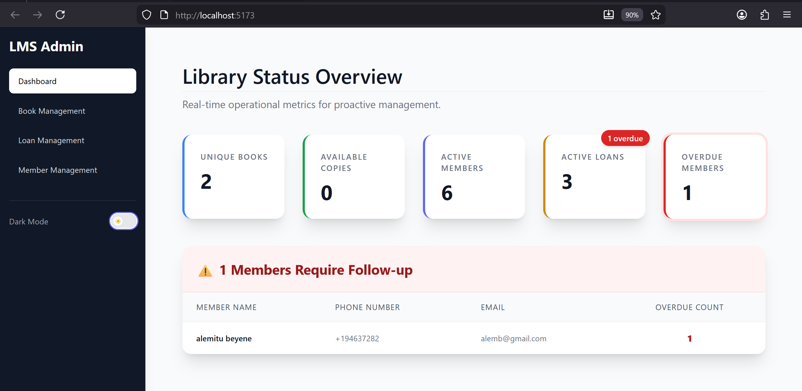
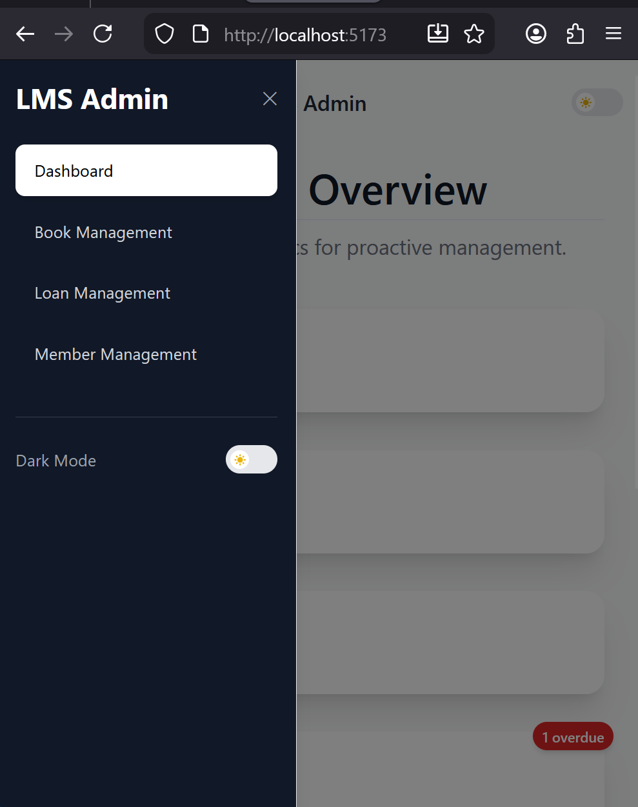
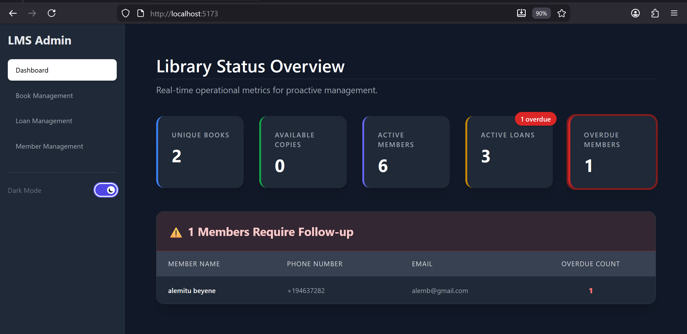

# Full Stack Library Management System

**Tagline:** A comprehensive, full-stack application for managing a library's books, members, and complex, transaction-safe loan operations, featuring a dedicated React client and a robust Node.js/MySQL API.

---

## LIVE DEMO
**[View Live Application on Vercel](https://library-app-tau-ruddy.vercel.app/)**
> **Note:** The backend is hosted on a free tier. Please allow **30-60 seconds** for the initial load if the server is sleeping.
---

## Application Preview

### Main Dashboard


<details>
<summary><b>View More Screenshots (Mobile, Dark Mode, Management)</b></summary>

### Book Management


### Loan Management


### Mobile Responsive View


### Dark Mode


### Modals

 </details>


## Component Documentation

This project includes dedicated README files for each module to provide further information on the specific logic, implementation, and features of the system:

* **[Backend API: Deep Dive & Endpoints](./backend/README.md)**
* **[Frontend Client: Architecture & Usage](./frontend/README.md)**

---

## Key Features of the System

* **Unified Full-Stack Design:** Dedicated folders for a **Frontend Client** (UI) and a **Backend API** (Data/Logic).
* **Transaction-Safe Loans:** Critical loan operations are protected by **database transactions** to prevent concurrency issues (handled by the API).
* **Data Integrity & Normalization:** Utilizes a highly normalized MySQL schema (3NF) to ensure accurate, real-time book availability reporting.
* **Soft Deletion:** Members are deactivated via a `soft delete` to preserve historical loan records.

---

## Technologies Used (Full Stack)

| Component | Key Technologies |
| :--- | :--- |
| **Backend API** | Node.js, Express.js, MySQL (`mysql2/promise`), CORS dotenv |
| **Frontend Client** | React.js (18+), vite, React Router DOM, Tailwind CSS,Axios |

---

## Installation and Running the Application

To run the entire system, you must start the API server and the client application separately.

### Prerequisites

* Node.js (v18+)
* MySQL Server (v8.0+)
* Git

### Step-by-Step Guide

1.  **Clone the Repository**
    ```bash
    git clone [YOUR_REPO_URL]
    cd [repo-name]
    ```

2.  **Setup the Database**
    * Ensure your MySQL server is running.
    * Create a database (e.g., `library_db`).
    * Run the schema script located in the `backend/` folder:
        ```bash
        mysql -u [YOUR_DB_USER] -p [YOUR_DB_NAME] < backend/schema.sql
        ```

3.  **Start the Backend API**
    * Navigate to the backend directory: `cd backend/`
    * Create a local **`.env`** file with your database credentials (See the [Backend README](./backend/README.md) for the required template).
    * Install dependencies and start the server:
        ```bash
        npm install
        npm start
        ```
    The API will be running at `http://localhost:3000`.

4.  **Start the Frontend Client**
    * Open a **new terminal window** and navigate to the frontend directory: `cd frontend/`
    * Create a **`.env`** file in this `frontend/` directory to define the API root:
        ```env
        VITE_API_BASE_URL=http://localhost:3000
        ```
    * Install dependencies and start the client:
        ```bash
        npm install
        npm run dev // Adjust this command based on your actual script (e.g., npm start)
        ```
    The client application will typically open at `http://localhost:5173` (or your configured port).

---
